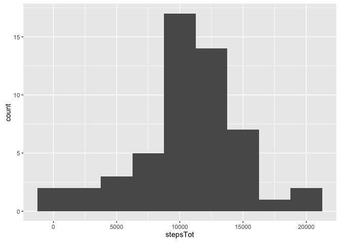
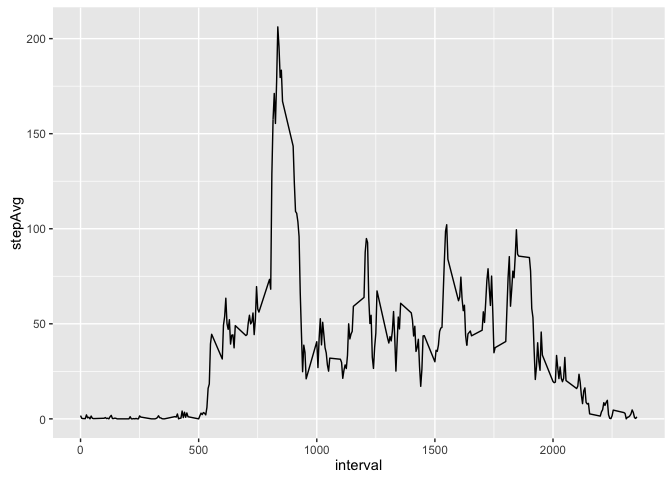
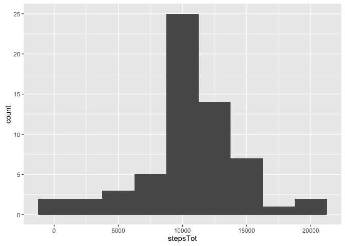
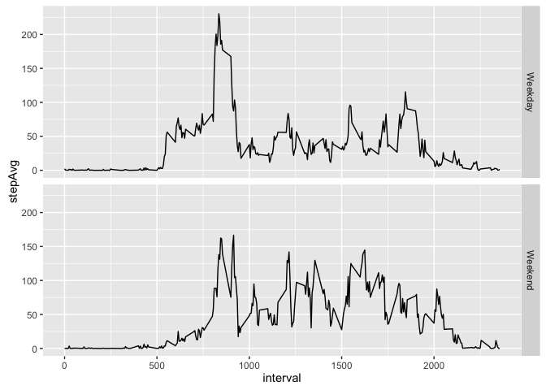

# Reproducible Research: Peer Assessment 1


## Loading and preprocessing the data
The first step here is to load the necessary packaages that will be used throughout
and then download/unzip the data before loading into R.  The last step here is 
removing the na cases from the dataset for the first few questions.

```r
library(ggplot2)
library(dplyr)

download.file("https://d396qusza40orc.cloudfront.net/repdata%2Fdata%2Factivity.zip","activity.zip")
activity <- read.csv(unzip("activity.zip"))
ActClean <- activity[complete.cases(activity),]
```


## What is mean total number of steps taken per day?
To compare the total steps by day, the data is first summarized, and then plotted as a histogram.  The mean and median of the data are very close, but the mean is slightly higher.


```r
steps_per_day <- ActClean %>%
      group_by(date) %>%
      summarize(stepsTot=sum(steps))

qplot(stepsTot,data=steps_per_day,binwidth=2500)
```

<!-- -->

```r
mean(steps_per_day$stepsTot)
```

```
## [1] 10766.19
```

```r
median(steps_per_day$stepsTot)
```

```
## [1] 10765
```


## What is the average daily activity pattern?
Similar to the total steps by day, the next step was to calculate the average steps
by interval.  The interval with the highest average is identified below as well.


```r
steps_by_interval <- ActClean %>%
      group_by(interval) %>%
      summarize(stepAvg = mean(steps))

qplot(interval,stepAvg,data=steps_by_interval,geom="path")
```

<!-- -->

```r
filter(steps_by_interval,stepAvg==max(stepAvg))[[1,1]]
```

```
## [1] 835
```

## Imputing missing values
There are many missing values in the data set, so a simple method has been performed to impute the missing data points.  The average for each interval was applied to any data point that had missing values.  Although there were a lot of missing cases, the method used to impute the data did not change the median, and only slightly changed the mean.


```r
MissingData <- activity[!complete.cases(activity),]
nrow(MissingData)
```

```
## [1] 2304
```

```r
ImputedData <- mutate(left_join(MissingData,steps_by_interval,by = "interval"),steps=stepAvg)[,1:3]
FinalData <-rbind(ActClean,ImputedData)

steps_per_day_imputed <- FinalData %>%
      group_by(date) %>%
      summarize(stepsTot=sum(steps))

qplot(stepsTot,data=steps_per_day_imputed,binwidth=2500)
```

<!-- -->

```r
mean(steps_per_day_imputed$stepsTot)
```

```
## [1] 10766.19
```

```r
median(steps_per_day_imputed$stepsTot)
```

```
## [1] 10766.19
```


## Are there differences in activity patterns between weekdays and weekends?
The last step was to evaluate the difference between the activity on weekdays and weekends.  The plot below shows that the activity does appear different for weekdays compared to weekends, showing a higher activity early in the day and towards the end of the day, but then lower throughout the day.


```r
FinalData<-mutate(FinalData,Type=as.factor(ifelse(
      weekdays(as.Date(FinalData$date))=="Sunday"|
            weekdays(as.Date(FinalData$date))=="Saturday","Weekend","Weekday")))

steps_by_interval_weekday <- FinalData %>%
      group_by(interval,Type) %>%
      summarize(stepAvg = mean(steps))

qplot(interval,stepAvg,data=steps_by_interval_weekday,facets=Type~.,geom="path")
```

<!-- -->


